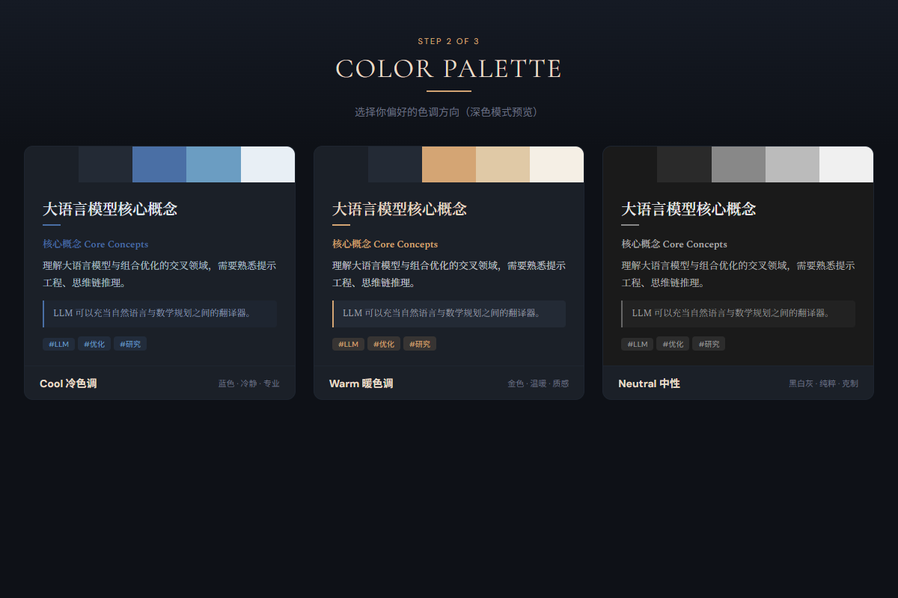
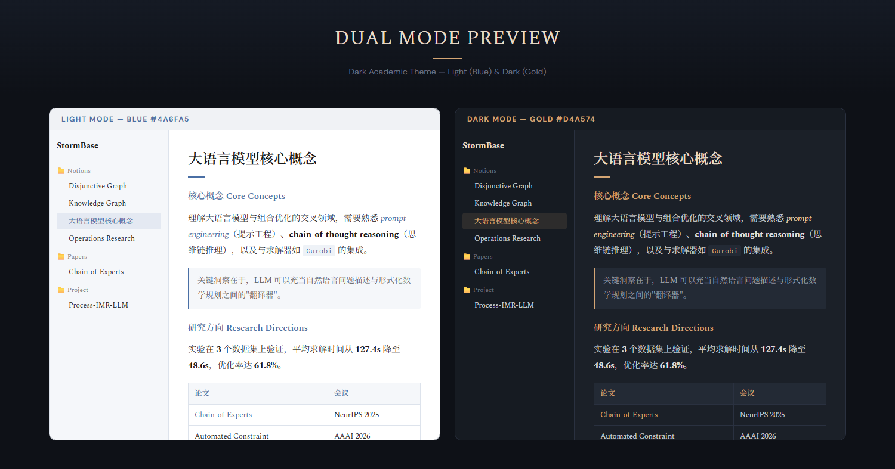

# Obsidian Theme Designer

**Stop trial-and-error. Design your Obsidian theme visually in the browser.**

**告别盲选主题。在浏览器中可视化设计你的 Obsidian 主题。**

A Claude Code skill that guides you through designing a custom Obsidian theme — step by step, visually, with live browser previews. No CSS knowledge needed.

一个 Claude Code 技能，通过逐步引导和浏览器实时预览，帮你设计 Obsidian 自定义主题。不需要 CSS 知识。

---

## How It Works 工作流程

### Step 1: Choose a Style Direction 选择风格方向

Pick from 5 visual directions — each shown as a live mockup, not just a label.

从 5 个风格方向中选择 —— 每个都以实际效果展示，而不是文字描述。

### Step 2: Pick Your Colors 选择配色

Choose cool, warm, or neutral tones. See them applied instantly.

选择冷色、暖色或中性色调，立即看到效果。

### Step 3: Find Your Font 选择字体

Browse 8-10 distinctive font pairings rendered with your actual content. Mix and match — pick Chinese from one card, English from another.

浏览 8-10 组特色字体搭配，用你的实际内容渲染。支持混搭 —— 中文选一个卡片的字体，英文选另一个。

### Step 4: Preview & Refine 预览和微调

See your complete theme in a full Obsidian simulation — sidebar, editor, light & dark mode side by side. Iterate until perfect.

在完整的 Obsidian 模拟界面中查看最终效果 —— 侧边栏、编辑器、浅色和深色模式并排展示。反复调整直到满意。

### Step 5: One-Click Install 一键安装

The skill generates a CSS snippet, installs fonts, and tells you exactly how to enable it in Obsidian. Done.

技能自动生成 CSS 代码片段、安装字体，并告诉你如何在 Obsidian 中启用。完成。

---

## Features 特性

- **Visual-first** — Every choice is shown in the browser, not described in text
- **Bilingual** — All previews include Chinese + English mixed content
- **Font intelligence** — Uses the `frontend-design` skill to pick distinctive, non-generic fonts
- **Dual mode** — Light and dark themes with independent accent colors
- **Auto font install** — Downloads and installs Google Fonts to your system (Windows/macOS/Linux)
- **Non-designer friendly** — Relatable analogies ("like a LaTeX PDF"), recommended defaults, reference image support

---

- **视觉优先** —— 所有选择都在浏览器中展示，不只是文字描述
- **双语支持** —— 所有预览都包含中英文混排内容
- **智能字体** —— 使用 `frontend-design` 技能选择有特色的非通用字体
- **双模式** —— 浅色和深色主题可以使用不同的强调色
- **自动安装字体** —— 从 Google Fonts 下载并安装到系统（Windows/macOS/Linux）
- **非设计师友好** —— 直观类比（"像 LaTeX PDF"）、推荐默认值、支持参考图

---

## Quick Start 快速开始

1. Copy `obsidian-theme-designer/` to `~/.claude/skills/`
2. Open your Obsidian vault folder in Claude Code
3. Say: **"帮我设计 Obsidian 主题"** or **"Design my Obsidian theme"**

---

1. 将 `obsidian-theme-designer/` 复制到 `~/.claude/skills/`
2. 在 Claude Code 中打开你的 Obsidian vault 文件夹
3. 输入：**"帮我设计 Obsidian 主题"** 或 **"Design my Obsidian theme"**

## Requirements 依赖

- [Claude Code](https://claude.ai/code)
- [superpowers](https://github.com/claude-plugins-official/superpowers) plugin (for Visual Companion browser previews)
- [frontend-design](https://github.com/claude-plugins-official/frontend-design) plugin (optional, for font selection)

## License

MIT
